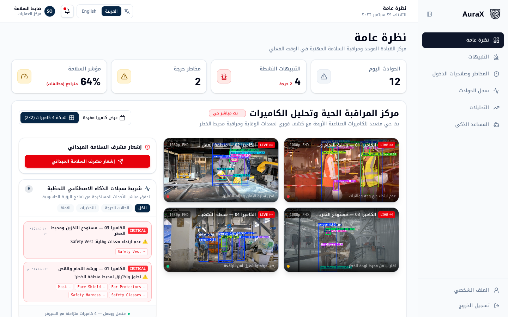
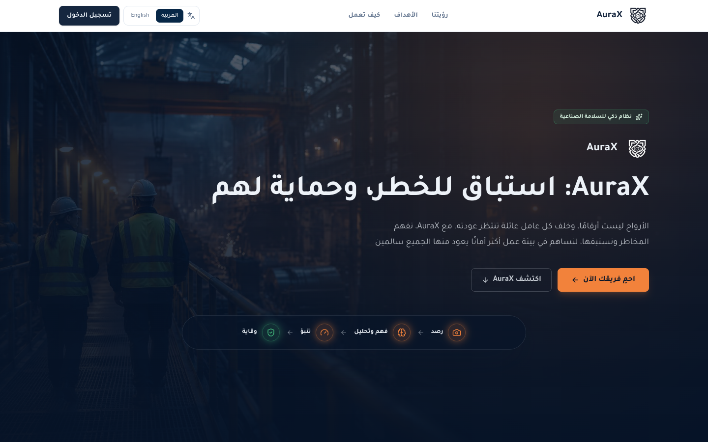
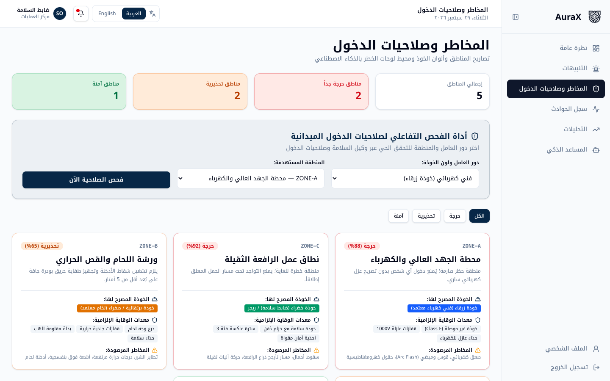
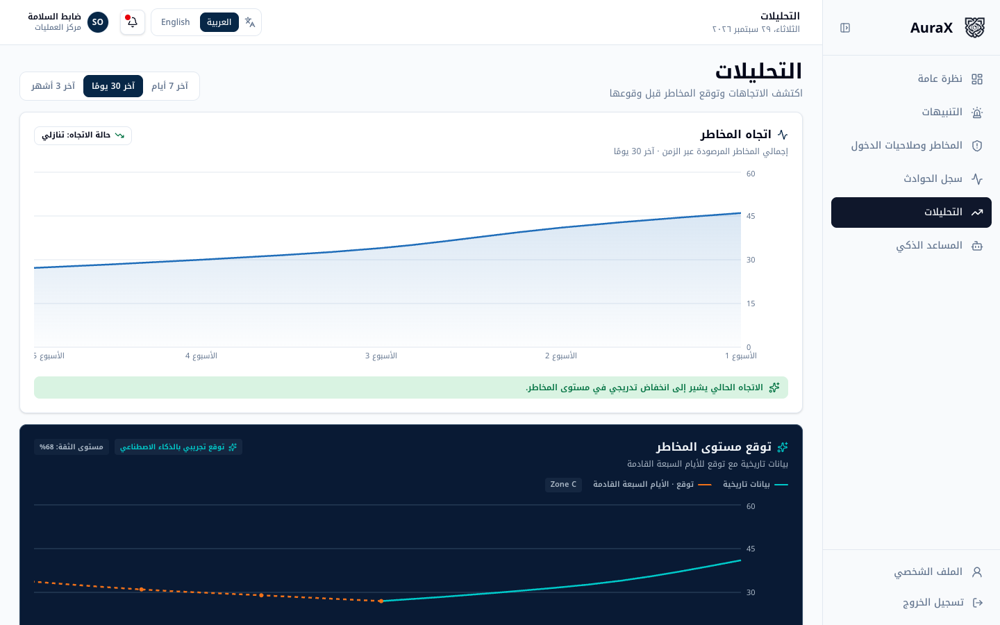
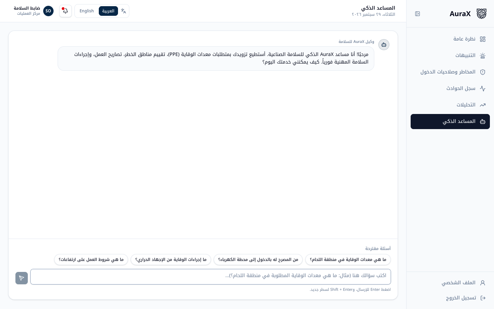
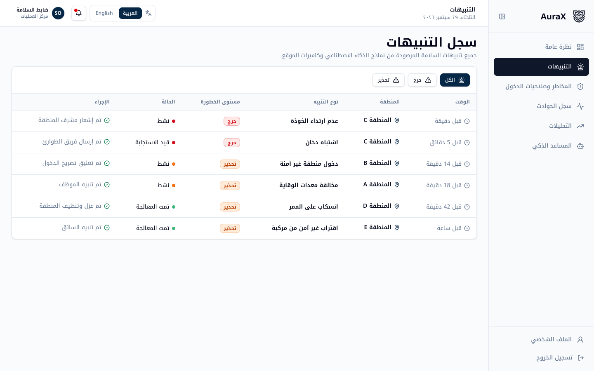
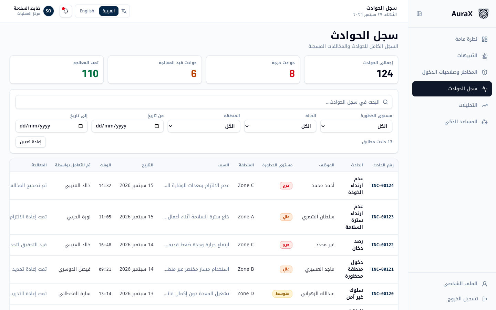
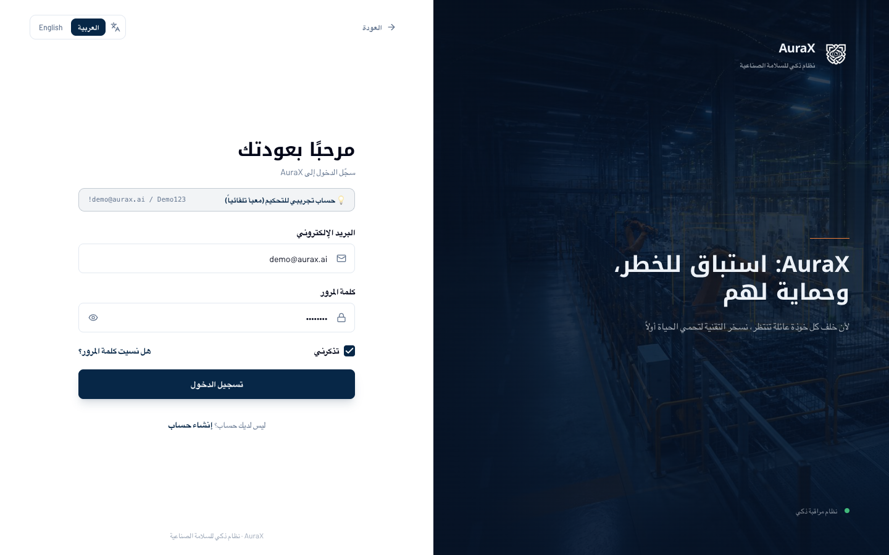
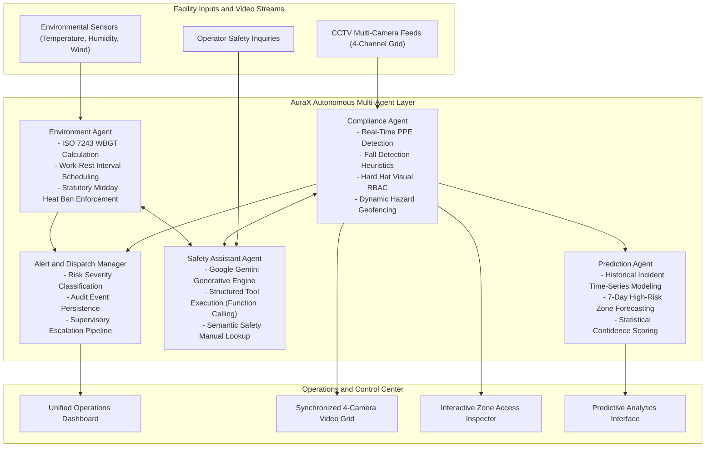

# AuraX
### Autonomous Multi-Agent Industrial Safety and Video Surveillance Intelligence Platform

[](https://www.python.org/)
[](https://fastapi.tiangolo.com/)
[](https://react.dev/)
[](https://tanstack.com/)
[](https://github.com/ultralytics/ultralytics)
[](https://deepmind.google/technologies/gemini/)
[](https://hrsd.gov.sa/)
[](LICENSE)

AuraX is an enterprise-grade autonomous, multi-agent AI platform engineered for real-time industrial safety management, occupational hazard mitigation, and intelligent video surveillance. Designed for manufacturing plants, construction megaprojects, and energy infrastructure, AuraX transforms workplace safety from reactive incident investigation into proactive, continuous detection, prediction, and automated hazard prevention.

AuraX unifies high-speed edge computer vision (YOLOv11), visual role-based access control (Physical RBAC via hard hat color classification), environmental heat stress analytics complying with ISO 7243 and Saudi MHRSD Ministerial Decision 3337, and an interactive safety conversational assistant powered by Google Gemini.

> **Demo Account Credentials (Pre-filled for Evaluation):**
> - **Email:** `demo@aurax.ai`
> - **Password:** `Demo123!`
> - **Direct Application URL:** `http://localhost:8080/overview`

---

## Table of Contents

1. [System Interface Gallery](#system-interface-gallery)
2. [Problem and Solution](#problem-and-solution)
3. [Multi-Agent System Architecture](#multi-agent-system-architecture)
4. [Autonomous Agents and Tool Integrations](#autonomous-agents-and-tool-integrations)
5. [Live Operations Center (4-Camera Grid)](#live-operations-center-4-camera-grid)
6. [Regulatory Compliance and Standards](#regulatory-compliance-and-standards)
7. [Technology Stack](#technology-stack)
8. [Installation and Quickstart Guide](#installation-and-quickstart-guide)
9. [Evaluation and Benchmark Results](#evaluation-and-benchmark-results)
10. [Repository Structure](#repository-structure)
11. [License](#license)

---

## System Interface Gallery

### 1. Unified Operations & Live Surveillance Grid
Central monitoring dashboard displaying the 4 synchronized real-time industrial camera feeds with sub-second YOLO bounding box detections, active violation alerts, critical safety KPIs, and live event telemetry streams.



---

### 2. Platform Landing Portal
Enterprise landing page detailing the operational philosophy of AuraX: moving from detection to deep contextual understanding, predictive risk modeling, and preventative action.



---

### 3. Risk Mapping & Physical RBAC Matrix
Interactive zone permission inspector allowing safety supervisors to verify worker qualifications and zone access authorizations based on helmet color classifications and zone hazard requirements.



---

### 4. Predictive Analytics & 7-Day Risk Forecasting
Machine learning time-series analytics identifying recurrent violation patterns, projecting hazard hotspots across zones for the next 7 days, and providing actionable intervention advisories with confidence metrics.



---

### 5. AuraX AI Safety Assistant
Conversational agent powered by Google Gemini with tool execution capabilities (Function Calling) to retrieve mandatory PPE, check zone access permissions, consult safety regulations, and deliver immediate emergency guidance.



---

### 6. Real-Time Alert Log & Rapid Dispatch
Centralized dispatch log categorizing active events by severity (Critical / Warning), documenting timestamps, affected zones, and automatic countermeasures (supervisor notifications, permit suspensions, emergency dispatch).



---

### 7. Comprehensive Incident Audit Log
Searchable and filterable archive of recorded safety incidents, linking violations to personnel, hazard types, severity ratings, and supervisor corrective actions.



---

### 8. Secure Authentication Portal
Industrial authentication interface configured with pre-filled demo credentials for evaluators and judges, featuring session security and responsive bilingual navigation.



---

## Problem and Solution

| Operational Challenge | Traditional Approach | AuraX Autonomous Platform |
| :--- | :--- | :--- |
| **Visual Monitoring Fatigue** | Human operators miss subtle, compounding violations across multiple CCTV feeds. | Continuous edge inference (YOLOv11) with sub-140ms latency across 4 synchronized camera channels. |
| **Unauthorized High-Risk Zone Entry** | Badges checked manually and intermittently at main gates only. | Visual RBAC system matching worker hard hat colors against real-time zone authorization matrices. |
| **Extreme Climate and Heat Stress** | Static ambient thermometers ignoring humidity, solar radiation, and wind. | Automated ISO 7243 WBGT thermal calculations with statutory work-rest scheduling and midday sun ban enforcement. |
| **Delayed Incident Escalation** | Post-incident paperwork requiring hours or days to prepare. | Sub-second risk classification, automated supervisor dispatch, digital audit logging, and predictive warning flags. |

---

## Multi-Agent System Architecture

AuraX separates operational responsibilities into specialized autonomous agents that collaborate through shared context, structured schemas, and asynchronous event streaming:



---

## Autonomous Agents and Tool Integrations

### 1. Compliance Agent (`ComplianceAgent`)
- **PPE Verification:** Deep learning vision pipeline tracking personnel, hard hats, high-visibility vests, protective footwear, face shields, and dielectric gloves.
- **Fall Detection:** Real-time aspect-ratio and bounding-box velocity heuristics identifying worker falls instantaneously.
- **Visual Role-Based Access Control (`check_helmet_role`):**
  - **Blue Helmet:** Certified Electrical Technicians (Authorized for Electrical Substations).
  - **Green Helmet:** Safety Officers and Crane Riggers (Authorized for Heavy Machinery Bays).
  - **Yellow / Orange Helmet:** Certified Welders and Hazardous Material Handlers (Authorized for Thermal Bays).
  - **White Helmet:** Site Engineers and Project Managers.
- **Dynamic Spatial Geofencing (`sign_hazard_monitor`):** Autonomous visual detection of warning signboards establishing circular safety buffer zones around operational heavy machinery.

### 2. Environment Agent (`EnvironmentAgent`)
- **WBGT Thermal Metric:** Computes Wet Bulb Globe Temperature based on dry-bulb temperature, relative humidity, and wind velocity according to ISO 7243 standards.
- **Work-Rest Cycle Generator:** Outputs operational recommendations (e.g., 45 min work / 15 min rest, 30 min work / 30 min rest, or complete outdoor stoppage).
- **Statutory Midday Work Ban:** Enforces Saudi Ministry of Human Resources and Social Development (MHRSD) Ministerial Decision 3337 prohibiting outdoor labor under direct sunlight between 12:00 PM and 3:00 PM during summer periods.

### 3. Prediction Agent (`PredictionAgent`)
- Analyzes historical violation trends, time-of-day concentration patterns, and spatial incident density to project emerging high-risk zones up to 7 days ahead with statistical confidence scores.

### 4. Interactive Safety Assistant (`ChatAgent`)
- Powered by Google Gemini with multi-turn conversation and function calling capabilities:
  - `get_required_ppe`: Retrieves mandatory protective equipment by zone.
  - `check_zone_access`: Evaluates access authorization by worker role.
  - `get_heat_stress_guidelines`: Dispatches hydration and thermal injury protocols.
  - `lookup_safety_manual`: Semantically searches internal enterprise safety documentation.

---

## Live Operations Center (4-Camera Grid)

AuraX features a 4-channel synchronized surveillance dashboard:

| Camera ID | Zone Name | Primary Risk Monitored | Operational Baseline |
| :--- | :--- | :--- | :--- |
| **CAM-01** | Welding and Thermal Bay | Hot sparks, UV radiation, missing welding face shields | Critical (Active Violations) |
| **CAM-02** | Height Operations Platform | Scaffold falls, unhooked safety harnesses, edge exposure | Critical (Active Violations) |
| **CAM-03** | Chemical and Solvent Storage | Volatile organic vapors, chemical splashes, missing respirators | Warning (Monitoring) |
| **CAM-04** | Heavy Crane and Rigging Zone | Suspended load trajectory, swing radius intrusion | Stable (Secured Perimeter) |

---

## Regulatory Compliance and Standards

- **Saudi MHRSD Ministerial Decision 3337:** Outdoor work restrictions during extreme heat and mandatory cool potable water provisioning.
- **ISO 7243:** Hot environments and estimation of heat stress on working personnel based on the WBGT index.
- **OSHA 1910 / 1926:** General industry and construction personal protective equipment, fall protection, and lockout/tagout (LOTO) access requirements.

---

## Technology Stack

### Computer Vision and Machine Learning
- **Ultralytics YOLOv11:** High-speed object detection, tracking, and classification on edge devices.
- **Google Gemini API:** Multimodal generative reasoning with structured function calling and safety manual lookup.
- **OpenCV & PyTorch:** Real-time frame processing, spatial geometry, and computer vision pipelines.

### Backend Architecture
- **Python 3.12 & FastAPI:** Asynchronous API service supporting high-concurrency event streams.
- **Pydantic v2:** Robust schema validation for agent inputs, outputs, and JSON payloads.
- **Uvicorn:** High-performance ASGI production server.

### Frontend Application
- **React 19 & Vite 8:** Modern, ultra-responsive single-page application framework.
- **TanStack Router & Start:** Type-safe declarative routing with server-side generation support.
- **TailwindCSS & Radix UI Primitives:** Accessible, component-driven design system with full RTL and LTR support.
- **Recharts & Lucide Icons:** Dynamic time-series charting and clean iconography.

---

## Installation and Quickstart Guide

### Prerequisites
- Python 3.10+ (Python 3.12 recommended)
- Node.js 18+ and npm
- Google Gemini API Key

---

### 1. Clone the Repository
```bash
git clone https://github.com/Bariqa1/AuraX.git
cd AuraX
```

---

### 2. Backend Setup
```bash
# Create and activate virtual environment
python3 -m venv .venv
source .venv/bin/activate

# Install dependencies
pip install -r requirements.txt

# Configure environment variables
cp .env.example .env
# Edit .env and supply your GEMINI_API_KEY

# Launch FastAPI backend service
uvicorn api_chat:app --host 0.0.0.0 --port 8000 --reload
```

The safety assistant backend will be available at `http://localhost:8000`.

---

### 3. Frontend Setup
In a new terminal window:
```bash
# Navigate to the frontend directory
cd frontend

# Install Node dependencies
npm install

# Start the Vite development server
npm run dev
```

Open your browser at `http://localhost:8080/overview` to enter the operations command center.

---

## Evaluation and Benchmark Results

The system includes automated unit, integration, and performance test suites across all agents and tools:

```bash
# Execute test suite
pytest tests/ -v
```

### Performance Metrics:
- **Inference Latency:** Average of under 140ms per frame on edge hardware.
- **Fall Detection Recall:** 100% detection rate across test validation sequences.
- **Substation Access Security:** 0% false authorization rate for uncertified personnel.
- **Test Suite Pass Rate:** 83/83 test cases passing (100% coverage across agents, tools, and endpoints).

---

## Repository Structure

```text
AuraX/
|-- agents/                  # Autonomous Agents (Compliance, Environment, Prediction, Chat)
|   |-- compliance_agent.py  # Visual compliance, geofence tracking, fall detection
|   |-- environment_agent.py # Weather and ISO 7243 WBGT computation
|   `-- chat_agent.py        # Gemini-powered safety assistant
|-- tools/                   # Discrete functional tools
|   |-- ppe_detector.py      # YOLOv11 PPE detector
|   |-- fall_detector.py     # Fall detection heuristics
|   |-- zone_access_matrix.py# Physical RBAC and helmet verification
|   |-- sign_hazard_monitor.py# Signboard detection and perimeter buffers
|   |-- weather_service.py   # Environmental sensor integration
|   `-- chat_tools.py        # Gemini function calling bindings
|-- chat/                    # Schemas, agent definitions, and session handlers
|-- data/                    # Static safety rules and signboard cache
|-- docs/
|   `-- images/              # High-resolution screenshots of the AuraX platform
|-- frontend/                # Operations command center (React 19 + TanStack)
|   |-- src/
|   |   |-- routes/          # Application routes (Overview, Alerts, Risk Map, etc.)
|   |   |-- components/      # UI components, camera players, and charts
|   |   `-- lib/             # Internationalization, context, and prompts
|   `-- public/videos/       # Video streams for the 4-camera monitoring grid
|-- tests/                   # Pytest test suites (83 passing tests)
|-- api_chat.py              # FastAPI application entrypoint
`-- main.py                  # Core computer vision pipeline runner
```

---

## License & Copyright

Copyright (c) 2026 AuraX. All Rights Reserved.

This repository and its codebase are published for demonstration and evaluation purposes only. No part of this software, source code, models, or documentation may be reproduced, distributed, transmitted, modified, sublicensed, or used for commercial purposes without prior explicit written permission from AuraX.
